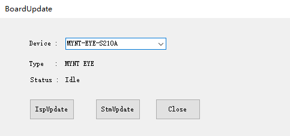

.. _firmware_upgrade:

相机/板载mcu固件及ISP如何进行升级
===================================

相机升级，需要使用我们提供的相机升级程序：MYNT EYE TOOL。

MYNT EYE TOOL的安装包，都在 `MYNTEYE_BOX <http://doc.myntai.com/mynteye/s/download>`_ 的 ``Firmwares`` 目录内。文件结构如下：

.. code-block:: none

  Firmwares/
  ├─Checksum.txt                 # file checksum
  ├─MYNTEYE_S_2.0.0_rc0.img      # firmware
  ├─...
  └─setup.zip                    # MYNTEYE TOOL zip

固件升级程序，目前仅支持 Windows ，所以需要你在 Windows 下进行操作。步骤如下：

下载准备
--------

* 下载并解压 ``setup.zip``。
* 下载固件，如 ``MYNTEYE_S_2.0.0_rc0.img`` 。

安装MYNT EYE TOOL
-----------------

* 双击 ``setup.msi`` 安装固件升级程序。

升级固件
--------

* USB3.0 口插上 MYNT® EYE 设备。

* 打开MYNT EYE TOOL，选择 ``Options/FirmwareUpdate`` 。

.. image:: ../../images/firmware_update_option.png

* 点击 ``Update`` 。

.. image:: ../../images/firmware_update.png
   :width: 60%

* 弹出警告对话框，直接 ``确定`` 即可。

  * 由于该操作会擦除固件，所以弹出警告。详情见 README 。

    * 通常在升级过程中，MYNT EYE TOOL会自动安装驱动。
    * 如果升级遇到问题，参考 README 解决。

.. image:: ../../images/firmware_update_warning.png
   :width: 60%

.. image:: ../../images/firmware_update_dir.png
   :width: 60%

* 在打开的文件选择框里，选择要升级的固件，开始升级。

.. image:: ../../images/firmware_update_select.png

* 升级完成后，状态变为 ``Succeeded`` 。

.. image:: ../../images/firmware_update_success.png
   :width: 60%

* 如果是需要升级板载ISP或者板载MCU，打开MYNT EYE TOOL之后点击 ``Options/BoardUpdate`` ，点击 ``IspUpdate`` 或者 ``Stm32Update`` 。

* 关闭MYNT EYE TOOL，结束。

.. ::

  .. image:: ../../images/firmware_update_driver.png
  .. image:: ../../images/firmware_update_driver_install.png
